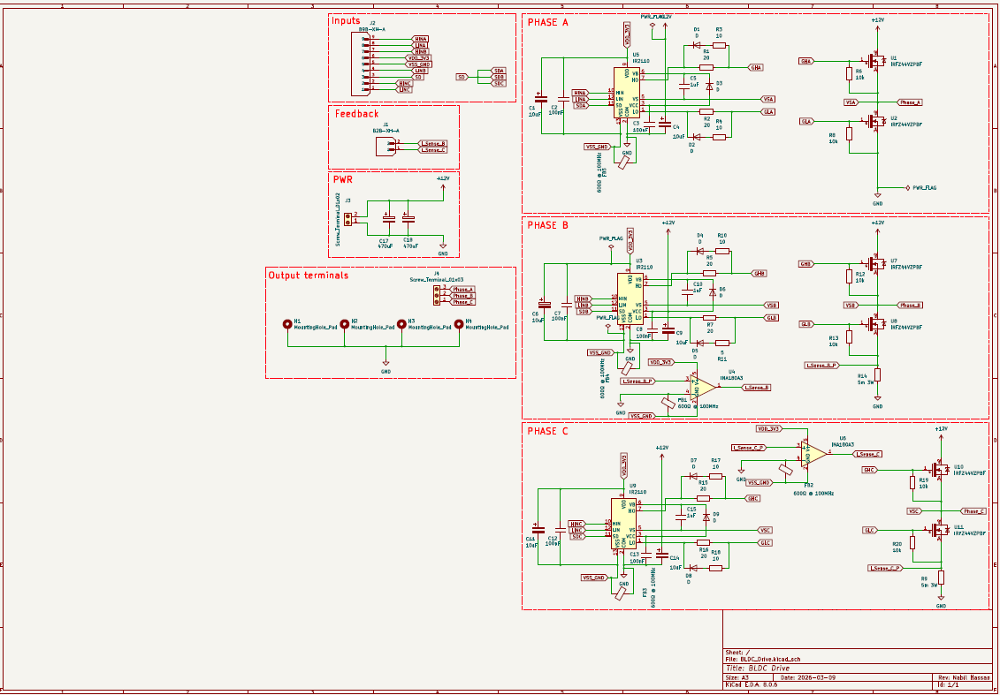

# BLDC Drive

A 3-phase Brushless DC (BLDC) motor driver PCB designed in KiCad, capable of handling **12V** supply voltage at **10–25A** continuous phase current.

---

## 📸 Board Preview

<!-- Replace the placeholder below with your actual board image -->
<!-- > 📷 **[Insert top-view board photo or 3D render here]** -->


---

## ✨ Features

- **Input Voltage:** 12V
- **Output Current:** 10–25A (per phase, depending on thermal management)
- **Gate Driver:** IR2110 half-bridge drivers (×3 — one per phase)
- **Power MOSFETs:** IRFZ44VZPBF N-channel MOSFETs in a 3-phase full-bridge configuration (6× total)
- **Current Sensing:** INA180A3 rail-to-rail current sense amplifiers
- **Bulk Decoupling:** 470µF electrolytic capacitors for supply filtering
- **EMI Filtering:** WE-CBF 0805 ferrite beads and 100nF bypass capacitors
- **Board Size:** 80mm × 80mm, 2-layer PCB
- **Connectors:** JST XH series (B2B-XH-A for signal, B9B-XH-A for motor phases)
- **Designed with:** KiCad 8.0

---

## 🖼 Schematic

<!-- Add schematic image or PDF link below -->
> 📐 **[Insert schematic screenshot or link here]**



<!-- Or link to the PDF: -->
<!-- [View Full Schematic (PDF)](BLDC_Drive/plots/BLDC_Drive__Assembly.pdf) -->
-->

---

## 🔩 Bill of Materials (BOM)

| Designator | Component | Value / Part Number | Description |
|---|---|---|---|
| Q1–Q6 | N-Channel MOSFET | IRFZ44VZPBF | Power switch, TO-220 |
| U1–U3 | Gate Driver | IR2110 | Half-bridge gate driver |
| U4–U6 | Current Sense Amp | INA180A3 | Rail-to-rail, 100V/V gain, SOT-23-5 |
| C_bulk | Electrolytic Cap | 470µF | Bulk supply decoupling |
| C_bypass | Ceramic Cap | 100nF | High-freq bypass |
| C_gate | Ceramic Cap | 1µF / 10µF | Gate drive bootstrap / filtering |
| R_sense | Shunt Resistor | 5mΩ 3W | Phase current sensing |
| R_gate | Resistor | 5Ω / 10Ω / 20Ω | Gate resistance |
| FB1–FBx | Ferrite Bead | WE-CBF 0805, 600Ω@100MHz | EMI filtering |
| J_motor | JST B9B-XH-A | 9-pin | Motor phase + hall sensor connector |
| J_signal | JST B2B-XH-A | 2-pin | Signal/control connector |
| — | Screw Terminals | 2-pin, 3-pin | Power input terminals |

> 📋 **Full interactive BOM:** [`BLDC_Drive/bom/ibom.html`](BLDC_Drive/bom/ibom.html)

---

## 📁 Repository Structure

```
BLDC_Drive/
├── BLDC_Drive/
│   ├── BLDC_Drive.kicad_sch         # Schematic
│   ├── BLDC_Drive.kicad_pcb         # PCB layout
│   ├── BLDC_Drive.kicad_pro         # KiCad project file
│   ├── bom/
│   │   └── ibom.html                # Interactive BOM
│   ├── Drill Files/                 # PTH and NPTH drill files
│   ├── gerber_to_order/             # Ready-to-order Gerbers
│   │   ├── BLDC_Drive_80.0x80.0mm_for_JLCPCB/
│   │   ├── BLDC_Drive_80.0x80.0mm_for_Elecrow/
│   │   ├── BLDC_Drive_80.0x80.0mm_for_PCBWay/
│   │   └── BLDC_Drive_80.0x80.0mm_for_FusionPCB/
│   └── plots/
│       └── BLDC_Drive__Assembly.pdf # Assembly drawing
├── AOD4184A/                        # KiCad library: AOD4184A MOSFET
├── IRFZ44VZPBF/                     # KiCad library: IRFZ44VZPBF MOSFET
├── LIB_DRV8353SRTAR/                # KiCad library: DRV8353 gate driver
├── B2B-XH-A/ & B9B-XH-A/           # KiCad library: JST connectors
├── LM358P/                          # KiCad library: LM358 op-amp
├── WE-CBF_0805/                     # KiCad library: ferrite bead
└── cap_calculator.jsx               # Bootstrap capacitor calculator tool
```

---

## 🖼 PCB Layout

<!-- Add PCB layout images below -->
> 🔲 **[Insert PCB top copper layer image here]**


---

## 🚀 Getting Started

### Requirements

- [KiCad 8.0](https://www.kicad.org/) or later
- A 12V DC power supply rated for at least 25A
- PWM control signals (typically from a microcontroller or dedicated BLDC controller)

### Opening the Project

1. Clone or download this repository.
2. Open KiCad and select **File → Open Project**.
3. Navigate to `BLDC_Drive/BLDC_Drive.kicad_pro`.
4. Import the custom component libraries from the component folders (see `how-to-import.htm` inside each folder).

### Ordering PCBs

Pre-generated Gerber files are available for major manufacturers inside `BLDC_Drive/gerber_to_order/`. Simply upload the appropriate `.zip` file to your fab of choice:

| Manufacturer | Gerber Package |
|---|---|
| JLCPCB | `BLDC_Drive_80.0x80.0mm_for_JLCPCB.zip` |
| PCBWay | `BLDC_Drive_80.0x80.0mm_for_PCBWay.zip` |
| Elecrow | `BLDC_Drive_80.0x80.0mm_for_Elecrow.zip` |
| FusionPCB | `BLDC_Drive_80.0x80.0mm_for_FusionPCB.zip` |

Recommended PCB specs: **2 layers, 2oz copper, HASL or ENIG finish.**

---

## ⚡ Electrical Specifications

| Parameter | Value |
|---|---|
| Supply Voltage (V_bus) | 12V |
| Continuous Phase Current | 10–25A |
| MOSFET V_DS rating | 60V (IRFZ44VZPBF) |
| MOSFET I_D rating | 55A (IRFZ44VZPBF) |
| Gate Driver Bootstrap voltage | 12V |
| Current sense gain | 100 V/V (INA180A3) |
| Shunt resistance | 5mΩ |

---

## ⚠️ Warnings & Safety Notes

- Always ensure proper heat sinking on the power MOSFETs (Q1–Q6) when operating above 10A.
- Do not exceed **12V** on the V_bus input without verifying all component voltage ratings.
- Verify gate drive bootstrap capacitor values using the included `cap_calculator.jsx` tool before assembling.
- The board does not include overcurrent protection hardware — implement this in firmware or add an external fuse rated for your load.
- This board is designed for **DC brushless motors only**. Do not connect it to AC loads.

---

## 🔧 Assembly Notes

> 🔩 **[Insert assembled board photo here]**

<!-- Example:

-->

- Begin soldering with the smallest SMD components first (ferrite beads, bypass caps, SOT-23 ICs).
- Solder power MOSFETs and screw terminals last.
- Refer to the interactive BOM (`bom/ibom.html`) for component placement guidance.
- The assembly drawing PDF (`plots/BLDC_Drive__Assembly.pdf`) can be printed as a reference during assembly.

---

## 👤 Author

**Nabil Hassan**
Revision date: 2026-03-09

---


## 🤝 Contributing

Pull requests and issue reports are welcome. If you find a bug in the schematic or layout, please open an issue with a description and reference designators.
